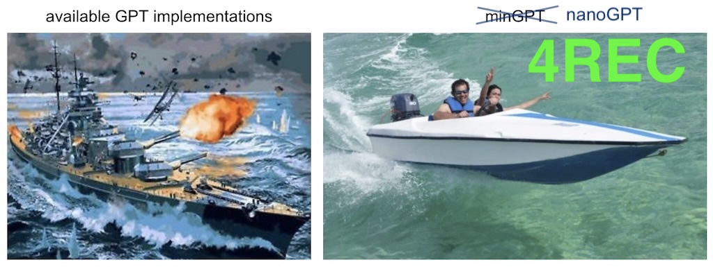

# NanoGPT4Rec: Sequential Recommendations


This repository extends [Andrej Karpathy's nanoGPT](https://github.com/karpathy/nanoGPT) implementation to create a transformer-based recommendation system.

## Quick Start

```bash
# Install dependencies
pip install -r requirements.txt

# Train model
python train.py --epochs 40 --batch_size 32 --block_size 50 --device mps
```

## Model Architecture

- 6 transformer layers
- 8 attention heads
- 256 embedding dimension
- Context features:
  - 4 temporal features (sin/cos encoding)
  - 1 time delta
  - 1 rating
  - 1 genre
- User embeddings (32 dim)
- Weight tying between input embeddings and output layer

## Acknowledgments

Built upon [nanoGPT](https://github.com/karpathy/nanoGPT) by Andrej Karpathy and uses the [MovieLens-1M](https://grouplens.org/datasets/movielens/1m/) dataset.

## License

See LICENSE file for details.
